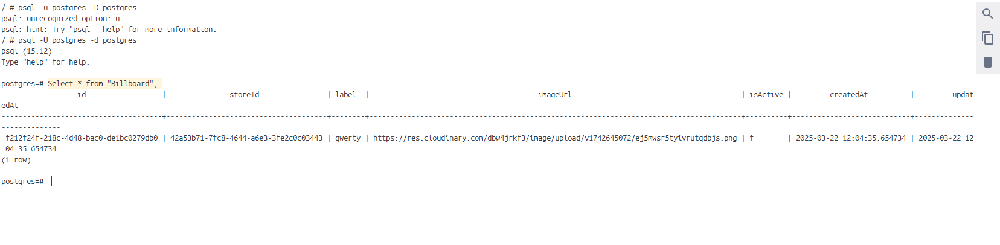

# E-Commerce

## Project Overview

This project is an e-commerce website that can be managed through my other project, E-Manager.
Users can browse products and filter them by category, size, and color. Upon checkout, a Stripe session is initiated to confirm the purchase. Once the purchase is completed, analytics will be updated in the E-Manager project.

## Configure Billboard and Store IDs

The first step is to set up the E-Manager project, as this e-commerce frontend communicates with the Go backend from that project.

* [E-Manager](https://github.com/BFaras/E-Manager)

Start by running the E-Manager project, then go to http://localhost:3000/. Log in using your Google account, then create a store and a billboard.

Once you did that, head to the docker app, open the docker image postgres-db and click on terminal tab and run these commands:


```shell

psql -U postgres -d postgres

Select * from "Billboard";

```

You should see output similar to this screenshot:



Take the id and storeId values from the result and set them in the start-project.sh file:

```shell

STORE_ID="<storeId>"
BILLBOARD_ID="<id>"

```
## Run the Project

Install Docker on your local machine and launch it.
  
Run the start-project.sh file using a tool like Git Bash:

```shell

./start-project.sh

```

## Showcase of the whole project

Want to see what the final result looks like? Watch this video showcasing all the features of the E-Manager and E-Commerce apps:

* [Video](https://youtu.be/Y5JePco9eVY)